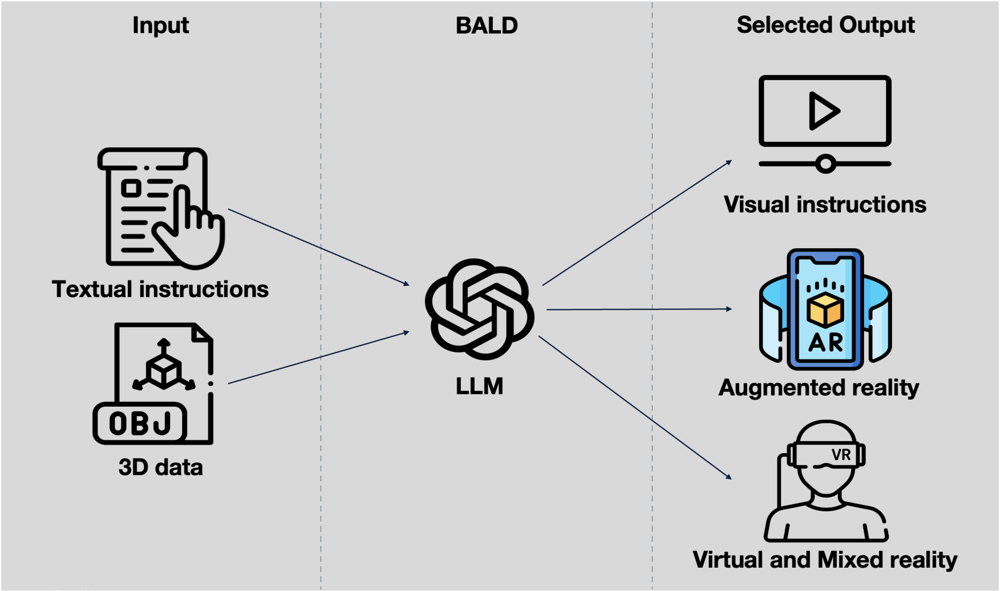

  
  

 

### Ferienakademie 2025

# Context-based mixed reality support for production

The goal of the Ferienakademie 2025 is to develop a flexible application which visualizes work instructions.  
_Input_: Textual instructions, 3D data, construction data, component plan  
_Output_: Video, cinematics model for AR & VR applications  
The goal is to flexibly generate a visualized output form based on the given inputs and an appropriate GenAI solution to enable industry 5.0 guidance in real world troubleshooting scenarios and manual work in production environments.

## Course description

  

 

Current developments of AI have already protrudet well into personal lives and are starting to influence the way we work. The goal of this Ferienakademie is to investigate different inovations in the realm of maintanance for industrial environments. One domain in which these use cases could be applied is the puzzle-parking environment put forward by our customer linova, in which the automated 3D garages are typically located remote and may be highly customized depending on the environment and stakeholder requirements

<table>
  <thead>
    <tr>
      <th style="width: 25%;">Visual Twin Generation</th>
      <th style="width: 25%;">Remote Maintenance Planning</th>
      <th style="width: 25%;">Real Time Quality Control</th>
      <th style="width: 25%;">Predictive Maintenance</th>
    </tr>
  </thead>
  <tbody>
    <tr>
      <td>
        In remote equipment operations, monitoring the state of the equipment is crucial. For example, consider a wind turbine or a puzzle-parking system. The goal of this use case is to create a visual twin of various environments by combining 3D files (e.g., CAD models used in equipment design) with images captured by autonomous remote drones. This virtual representation enables real-time monitoring of the environment using VR. Additionally, any changes to the equipment, such as damage or planned modifications, should be documented.
      </td>
      <td>
        Planning maintenance procedures for remote equipment can be challenging, especially when various factors are unknown. In this use case, a process should be developed to automatically generate a maintenance plan by integrating information from multiple stakeholders, including a digital twin, expert engineering knowledge, and input from local stakeholders. The process should also account for the possibility that the equipment might be custom-built, requiring tailored solutions.
      </td>
      <td>
        In maintenance processes, it is common to apply the four-eye principle as a quality control measure. The goal of this use case is to replace two of those eyes with AI-powered cameras that record and document the maintenance  process. This documentation should then be compared to the maintenance plan to evaluate the accuracy and quality of the repairs.
      </td>
      <td>
        For large, moving machines, different parts wear out at varying intervals. The aim of this use case is to combine various data sources, such as machine logs, maintenance documentation, and reports of previous failures, to predict future damages. By identifying potential issues in advance, downtime can be minimized by applying preventative measures or patches beforehand.
      </td>
    </tr>
  </tbody>
</table>

## Customers

TODO: add customer logos

## Course Team

### Instructors

- **Prof. Dr. Bernd Brügge**  
    Technical University of Munich  
    Applied Software Engineering

- **Prof. Dr. Jörg Franke**  
    Friedrich-Alexander-Universität  
    Fertigungsautomatisierung und Produktionssystematik

### Guest Lecturers

- **TBD**  
    Title  
    Siemens Healthineers

- **Dr. Andreas Löhr**  
    Chief Technical Officer  
    Linova

### Research Associates

- **Felix Mahr, M.Sc.**  
    Friedrich-Alexander-Universität  
    Fertigungsautomatisierung und Produktionssystematik

- **Leander Pfeiffer, B.Sc.**  
    Technical University of Munich  
    Mechanical Engineering
