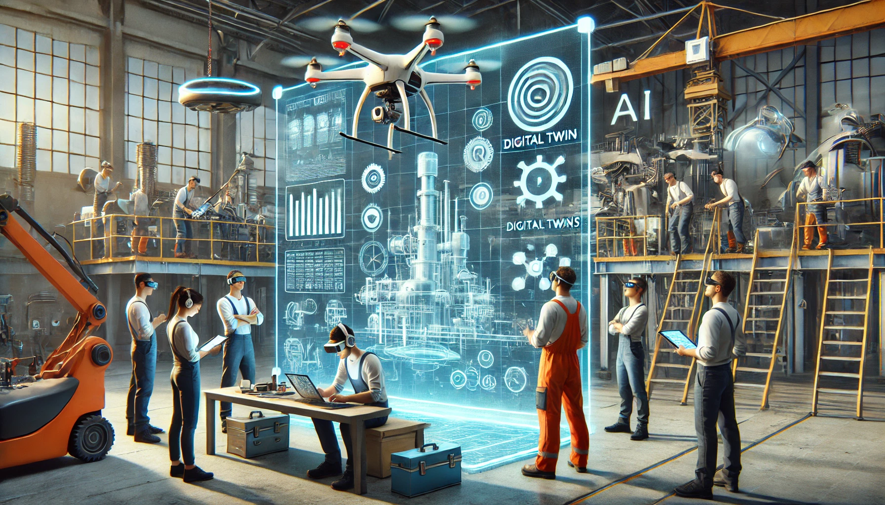

  
  

 

### Ferienakademie 2025

# Context-based mixed reality support for production

_Unlocking the Future of Industrial Training & Maintenance with Artificial Intelligence and Virtual Reality_

  

 

Artificial intelligence is rapidly transforming both our personal lives and the way we work. In this Ferienakademie, we will explore groundbreaking innovations in industrial training and maintenance, leveraging the power of generative Artificial Intelligence (genAI), Virtual Reality (VR), Augmented Reality (AR) and other cutting-edge technologies. Our goal is to assess two real-world scenarios proposed by our industry partners, Siemens Healthineers and Linova, bringing visionary ideas to life.

## Industrial training

Traditional manufacturing training often relies on outdated documents, static images, and lengthy manuals. But what if learning new assembly processes could be immersive, interactive, and AI-powered?

Imagine a scenario where existing documents, such as PDF files, images, and 3D models, can seamlessly be used as input data to generate advanced visualizations. With the power of generative AI, this information can be transformed effortlessly into animated video-based content, augmented reality, or virtual reality training.

Users can select their preferred output format, customize the scope of their training—whether for new employees or experienced workers—and even integrate advanced tools like Vision Pro and other VR/AR technologies to create immersive learning environments. The system also generates both audio and text outputs, catering to different learning styles and enhancing comprehension.

This technology allows companies to provide customized learning experiences for new employees and experienced professionals alike. Training can be adapted to different skill levels, ensuring that every worker gets the guidance they need. The system also supports multiple languages, enabling companies to train a global workforce without additional effort.

With cutting-edge extended reality technology, employees can engage with their training in a way that feels natural and intuitive. Instead of reading through dense documents, they can experience step-by-step guidance in a fully immersive environment.

This is the future of industrial training: faster, smarter, and more effective.

## Industrial maintanance

Industrial maintenance is often reactive, costly, and inefficient. But what if it could be predictive, autonomous, and powered by digital twins?  

Imagine a future where AI-driven digital twins provide real-time, remote system diagnostics. High-resolution cameras, LiDAR sensors, and drones continuously scan industrial equipment, generating up-to-date digital replicas of machinery and infrastructure. These digital twins enable engineers to monitor wear, detect anomalies, and simulate maintenance procedures remotely before taking action—reducing downtime and preventing failures.  

Autonomous drones equipped with vision systems can inspect hard-to-reach areas, capturing detailed thermal and structural data. AI algorithms analyze this information, identifying early signs of mechanical stress, misalignment, or component degradation. When an issue is detected, maintenance teams receive instant alerts through AR-powered smart glasses, displaying real-time overlays of schematics, diagnostics, and guided repair steps.

Predictive maintenance platforms leverage historical data and sensor feedback to anticipate failures before they happen. Spare parts are automatically ordered and dispatched, ensuring repairs happen before breakdowns occur.  

With digital twins, drone-assisted inspections, and genAI-driven automation, industrial maintenance transforms from a reactive process into a seamless, predictive system. The result? Reduced downtime, lower costs, and a future where machines maintain themselves.

## Course organization

Participants will work in agile teams, fostering an environment of collaboration and independent problem-solving. While prior experience with AI or VR is not required, students should bring a strong interest in emerging technologies and a willingness to engage with new concepts. This project offers an opportunity to develop practical skills, exchange knowledge with peers, and contribute to innovative solutions in a dynamic and interdisciplinary setting.

## Customers

### Siemens Healthineers

Siemens Healthineers is a leading global medical technology company specializing in innovative healthcare solutions. They develop and manufacture advanced imaging, diagnostic, and therapeutic systems, including MRI and CT scanners, laboratory diagnostics, and robotic-assisted surgery technologies. Their focus is on improving patient outcomes, enhancing healthcare efficiency, and driving digital transformation through AI-powered diagnostics, automation, and data-driven decision-making. With a strong emphasis on precision medicine and personalized healthcare, Siemens Healthineers plays a key role in shaping the future of medical technology.

### Linova

Linova is a software consulting company based in Munich, specializing in custom software development and digital transformation solutions for businesses across various industries. They provide innovative software solutions that optimize business processes, enhance operational efficiency, and support digital growth. With expertise in areas such as enterprise software, cloud computing, and data integration, Linova helps organizations leverage technology to achieve their strategic goals. By focusing on agile methodologies and collaborative partnerships, Linova delivers tailored solutions that drive long-term success and innovation for their clients.

## Course Team

### Instructors

- **Prof. Dr. Bernd Brügge**  
    Technical University of Munich  
    Applied Software Engineering

- **Prof. Dr. Jörg Franke**  
    Friedrich-Alexander-Universität  
    Fertigungsautomatisierung und Produktionssystematik

### Guest Lecturers

- **Dr. Jens Fürst**  
    Principal Key Expert Digitalization  
    Siemens Healthineers AG

- **Dr. Andreas Löhr**  
    Chief Technical Officer  
    Linova

### Research Associates

- **Felix Mahr**  
    Friedrich-Alexander-Universität  
    Fertigungsautomatisierung und Produktionssystematik

- **Leander Pfeiffer**  
    Technical University of Munich  
    Mechanical Engineering
